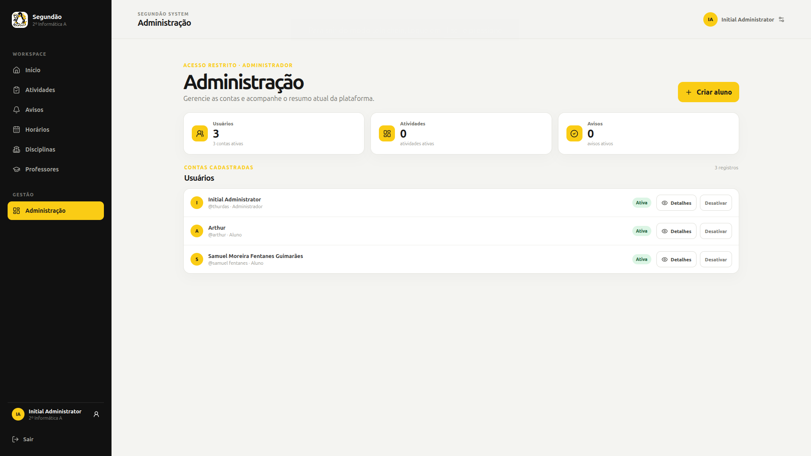
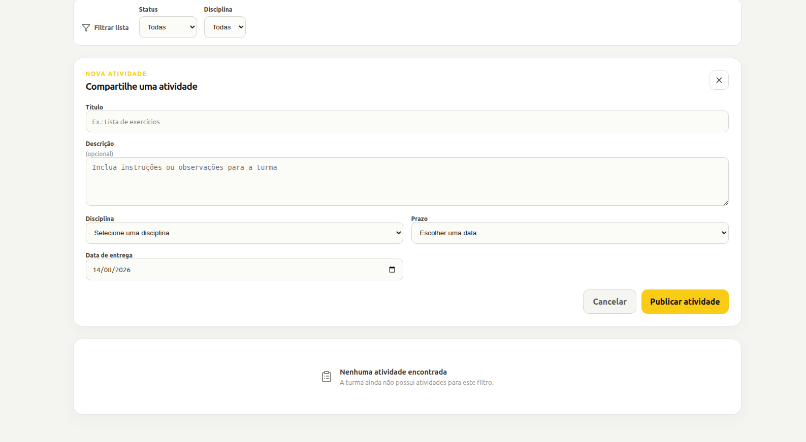
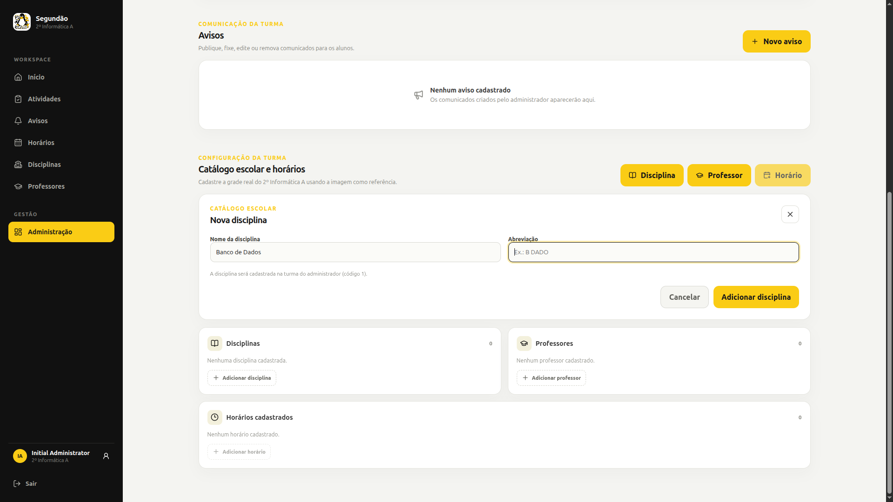

# Segundão System

  

  Uma plataforma criada para deixar a rotina da turma mais organizada, clara e acessível.

  <strong>2º Informática A · Mundo Novo, Bahia</strong>

---

## Sobre o projeto

O **Segundão System** reúne, em um só lugar, as principais informações do dia a dia escolar da turma **2º Informática A**.

O sistema foi pensado para aproximar alunos e organização escolar, facilitando o acompanhamento de atividades, avisos, horários e informações da turma.

## Funcionalidades principais

### Para alunos

- dashboard com visão geral da turma;
- acompanhamento de atividades e prazos;
- marcação individual de atividades concluídas;
- mural de avisos;
- consulta de horários, disciplinas e professores;
- visualização da próxima aula;
- perfil individual.

### Para administradores

- criação e gerenciamento de contas de alunos;
- publicação e organização de avisos;
- cadastro de disciplinas e professores;
- associação de professores às disciplinas;
- gerenciamento dos horários da turma;
- visão geral da organização escolar.

## Prévia do sistema

  
  
  

## Tecnologias

<h3 align="center">Backend</h3>

  

<h3 align="center">Frontend</h3>

  

<h3 align="center">Ferramentas</h3>

  

## Sobre a escola e a turma

O projeto foi desenvolvido para os alunos do [Centro Territorial de Educação Profissional Piemonte do Paraguaçu II](https://escolas.educacao.ba.gov.br/node/12568), escola técnica localizada em **Mundo Novo, Bahia**.

O Segundão System nasce das necessidades reais da turma **2º Informática A** e busca transformar a organização da rotina escolar em uma experiência mais simples e colaborativa.

## Status atual

**Em desenvolvimento.** O backend e o frontend já estão integrados, com as principais áreas da rotina da turma disponíveis para uso.

## Próximos passos

- aperfeiçoar a área administrativa;
- evoluir a organização e a manutenção dos dados;
- explorar notificações e novas formas de comunicação com a turma.

  Feito para a turma <strong>2º Informática A</strong>.

